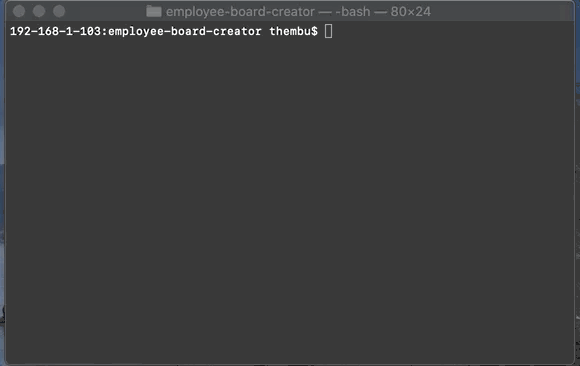
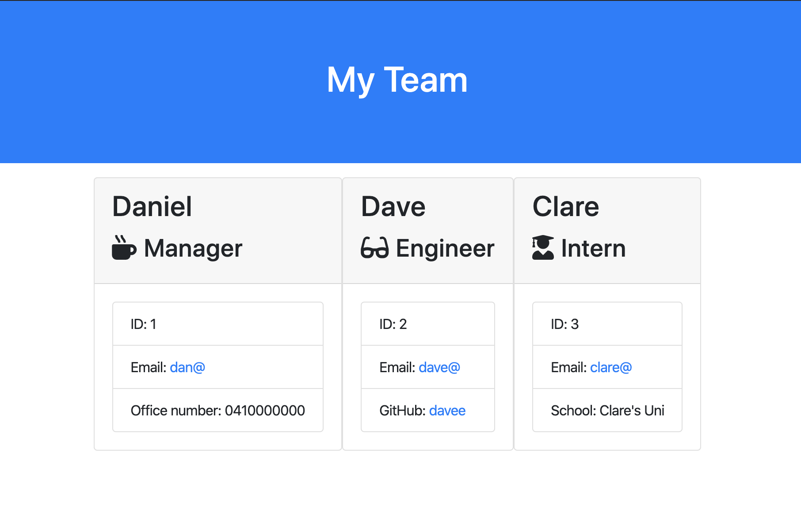

# Employee Board Creator

### Description

This is an exercise in creating a command line interface that validates user inputs with tests and then renders HTML based on classes and extending classes.

- [User-Story](##User-Story)
- [Challenge](##Challenge)
- [Screenshots](##Screenshots)
- [Results](##Results)
- [Lessons-Learned](##Lessons-Learned)

## User-Story

```
As a manager
I want to generate a webpage that displays my team's basic info
so that I have quick access to emails and GitHub profiles
```

## Challenges

One of the biggest challenges was trying to keep a clear naming structure when creating Objects and Classes.

Using Async functions to build out the HTML for a page, dependent on user input, was also a wee bit confusing. For the longest time I was only able to generate the components but return "Undefined" values.

## Screenshots

The jest tests for this application complete as required, as seen in the gif below.

.

The command line application can be seen in the gif below.

.

A screen shot of the HTML output can be seen belwo.

.

## Results

The required outputs of this project, including this README, the url of the deployed web application and the url of this repo.

- Github Repo - https://github.com/spatiality-dc/employee-board-creator

## Lessons Learned

- Using classes to inherit features is useful in quickly building out dynamic aspects of web pages. But adding in overrides and restrictions can be a bit difficult to comprehend.

- Javascript is still hard.
